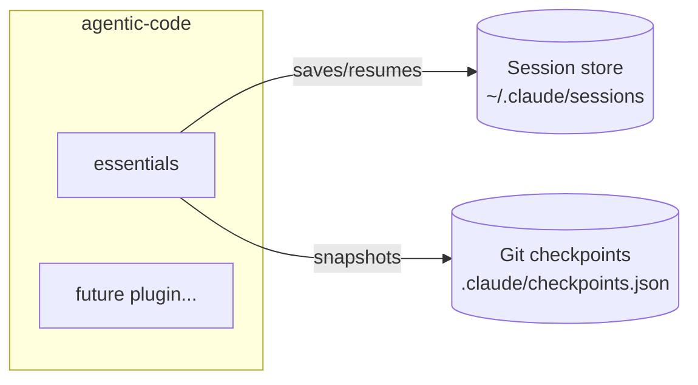

# agentic-code

A personal collection of modular Claude Code plugins. Each plugin has a specific, focused purpose — install only what you need for what you're doing, and remove it when you don't.

Built for my own workflow, but public in case anyone finds them useful.

---

## Philosophy

- **Modular** — one plugin, one responsibility. No bloat.
- **On/off by design** — install when relevant, uninstall when not.
- **Context-aware** — each plugin is meant to solve a real friction point in agentic coding workflows.
- **No dependencies** — plain Node.js and Markdown. Nothing to install, nothing to break.

---

## Plugins

| Plugin | Purpose | Skills |
|--------|---------|--------|
| [essentials](./essentials) | Session management across Claude Code sessions | `/essentials:sessions-setup` `/essentials:sessions-save` `/essentials:sessions-resume` `/essentials:sessions-update` `/essentials:sessions-checkpoint` |

---

## How plugins relate



---

## Installation

### 1. Register the marketplace once

```bash
/marketplace add agentic-code https://raw.githubusercontent.com/juanescendales/agentic-code/main/marketplace.json
```

### 2. Install what you need

```bash
/plugin install essentials@agentic-code
```

### 3. Uninstall when you don't need it

```bash
/plugin uninstall essentials
```

---

## Manual installation (no marketplace)

```bash
git clone https://github.com/juanescendales/agentic-code
cp -r agentic-code/essentials ~/.claude/plugins/essentials
```

---

## Adding a new plugin

Each plugin lives in its own directory at the root of this repo:

```
agentic-code/
├── marketplace.json       ← add an entry here
├── essentials/            ← existing plugin
└── your-new-plugin/       ← new plugin
    ├── .claude-plugin/
    │   └── plugin.json
    └── skills/
        └── your-skill/
            └── SKILL.md
```

Then add the plugin to `marketplace.json` and it becomes available to anyone using this marketplace.

---

## License

MIT — use freely, modify as you like.
