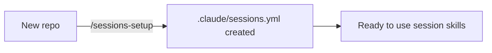
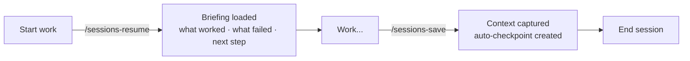
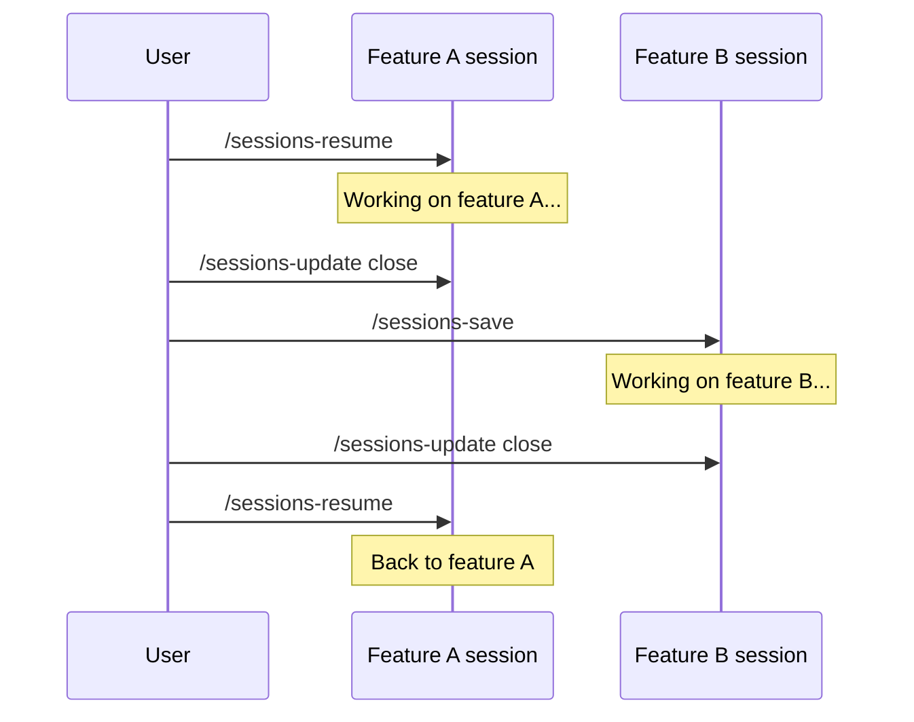

# essentials

Core session management skills for Claude Code. Maintain full context across sessions — what was built, what failed, what's next — organized per repository.

## Skills

| Skill | Command | Description |
|-------|---------|-------------|
| sessions-setup | `/sessions-setup` | One-time init: creates `.claude/sessions.yml` |
| sessions-save | `/sessions-save` | Save current session with full context + checkpoint |
| sessions-resume | `/sessions-resume` | Load the most recent active session for this project |
| sessions-update | `/sessions-update` | Refresh session context mid-work + auto-checkpoint |
| sessions-update close | `/sessions-update close` | Refresh then close the session |
| sessions-checkpoint | `/sessions-checkpoint create\|verify\|list\|clear` | Manual git-based snapshots |

## Install

```bash
# Global (all projects)
cp -r skills/* ~/.claude/skills/

# Project-level only
cp -r skills/* .claude/skills/
```

Run `/sessions-setup` once per repository before using any other skill.

---

## Workflows

### 1. First time in a repository

```
/sessions-setup
```

Detects the project name from git remote or directory name, writes `.claude/sessions.yml`. Takes seconds. Never needs to run again for this repo.



---

### 2. Standard daily workflow

Save at the end of each session, resume at the start of the next.



**Day 1:**
```
# Work happens...
/sessions-save      ← captures everything before closing Claude
```

**Day 2:**
```
/sessions-resume    ← full briefing: what was built, what failed, exact next step
# Continue where you left off...
/sessions-save      ← save again at the end
```

---

### 3. Long-running feature (multi-day)

Use `sessions-update` to refresh context mid-work without creating a new session directory. Each update creates a checkpoint so you can diff against it later.

```mermaid
flowchart LR
    A[/sessions-save] -->|Day 1| B[session dir created]
    B -->|Day 2| C[/sessions-resume]
    C --> D[Work...]
    D -->|mid-work| E[/sessions-update]
    E --> F[context refreshed\ncheckpoint created]
    F --> G[More work...]
    G -->|feature done| H[/sessions-update close]
```

```
# Day 1 — start the feature
/sessions-save

# Day 2 — resume and work
/sessions-resume
# ... implement core logic ...
/sessions-update          ← refresh context, creates checkpoint

# Day 3 — finish
/sessions-resume
# ... finish and test ...
/sessions-update close    ← final update, marks session closed
```

---

### 4. Checkpoint-heavy workflow (risky refactors, migrations)

Manual checkpoints for when you need the ability to verify exact state at specific moments.

```mermaid
flowchart LR
    A[/sessions-resume] --> B[checkpoint: before-refactor]
    B --> C[Refactor...]
    C --> D{Tests pass?}
    D -->|yes| E[checkpoint: refactor-done]
    D -->|no| F[verify before-refactor]
    F -->|see diff| G[Debug...]
    G --> D
    E --> H[/sessions-update]
```

```
/sessions-resume
/sessions-checkpoint create before-refactor

# ... risky changes ...

/sessions-checkpoint verify before-refactor   ← diff against snapshot
/sessions-checkpoint create refactor-done

/sessions-update    ← save progress with auto-checkpoint
```

**Checkpoint actions:**
```
/sessions-checkpoint create <name>    # snapshot current git state
/sessions-checkpoint verify <name>    # diff current state vs that snapshot
/sessions-checkpoint list             # show all checkpoints
/sessions-checkpoint clear            # keep last 5, remove older ones
```

---

### 5. Coming back after a long break

Sessions-resume warns you when a session is old and flags referenced files that no longer exist.

```
/sessions-resume
```

Output includes:
```
⚠️ This session is 12 days old — verify file states before proceeding.

WHAT NOT TO RETRY:
- Approach X — failed because: exact reason here

NEXT STEP:
exact thing to do, no thinking required
```

The "WHAT NOT TO RETRY" section is the most important part of a session — it prevents repeating mistakes from previous sessions.

---

### 6. Switching between parallel threads

Each `/sessions-save` creates a **new directory** — previous sessions are never overwritten. Close the current thread before switching.



```
/sessions-resume              ← loads feature A (most recent non-closed)
# ... work on feature A ...
/sessions-update close        ← close feature A thread

/sessions-save                ← start feature B session
# ... work on feature B ...
/sessions-update close        ← close feature B

/sessions-resume              ← loads feature A again (most recent non-closed)
```

---

## What gets captured in a session

Each session is a **directory**, not a file:

```
<sessions_dir>/
  2026-03-22-a1b2c3d4/
    session.md      ← context, decisions, what worked/failed, next step
    plan.md         ← if a plan was created during the session
    research.md     ← if research was done
    [other files]   ← any artifact generated during the session
```

`session.md` always includes:

| Section | Purpose |
|---|---|
| What WORKED | Evidence-backed wins (test passed, ran in browser, etc.) |
| What Did NOT Work | Exact reason each approach failed — prevents retrying them |
| What Has NOT Been Tried | Promising approaches still queued |
| Current State of Files | Per-file status table |
| Exact Next Step | Precise enough to resume without thinking |
| Last Checkpoint | Git SHA of the most recent auto-checkpoint |

---

## Storage

Config in `.claude/sessions.yml` per repository:

```yaml
project: my-api
sessions_dir: ~/.claude/sessions/my-api
```

Change `sessions_dir` to store sessions inside the repo (`.claude/sessions`) or any custom path.

| File | Location | Purpose |
|---|---|---|
| `sessions.yml` | `.claude/sessions.yml` | Project config (name + storage path) |
| `session.json` | `.claude/session.json` | Active session pointer (created on resume/save, cleared on close) |
| `checkpoints.json` | `.claude/checkpoints.json` | All checkpoints for this project |
